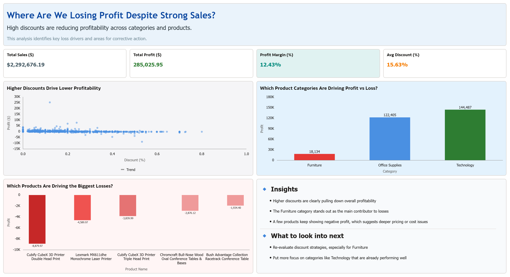

# Sales Profitability & Discount Impact

Understanding why strong sales are not translating into profit.

---

## Overview

This project analyzes how discount strategies affect profitability using the Superstore dataset in Oracle Analytics Cloud (OAC).

While sales performance appears strong, the analysis shows that increasing discount levels are consistently linked to lower profit margins across categories and products.

---

## Dashboard Preview

---

## Insights

• Higher discount levels are directly impacting profitability  
• Furniture category contributes the most to losses  
• A few products consistently show negative profit  

---

## What this means

• Discounting needs to be controlled, especially beyond certain thresholds  
• Furniture category requires closer pricing and cost evaluation  
• Loss-making products need review or repositioning  

---

## Tools Used

• Oracle Analytics Cloud (OAC)  
• Superstore Sales Dataset  

---
## Files

• dashboard.png – dashboard snapshot  
• Sales_Profitability_Discount_Impact.dva – OAC workbook  
## Problem Statement

Despite strong sales performance, profit margins remain low.  
This project investigates how discount strategies are affecting profitability across categories and products.
